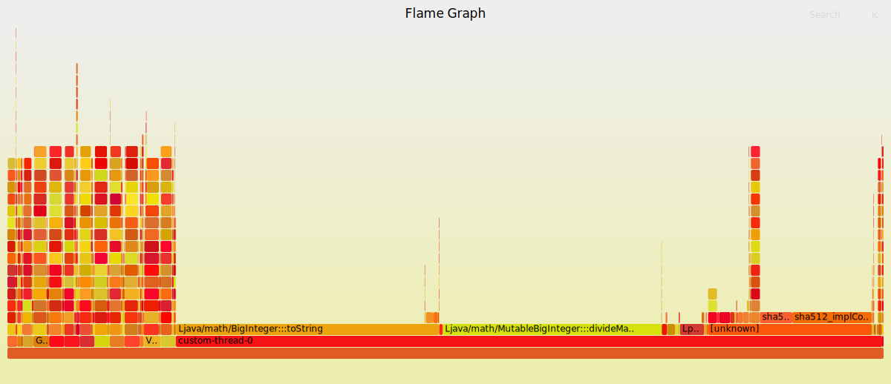
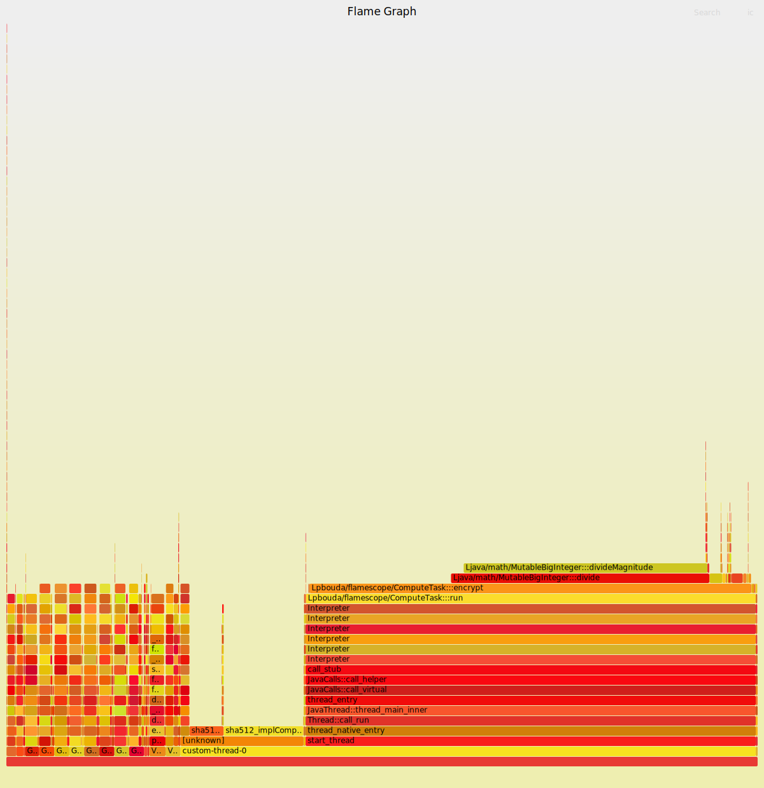
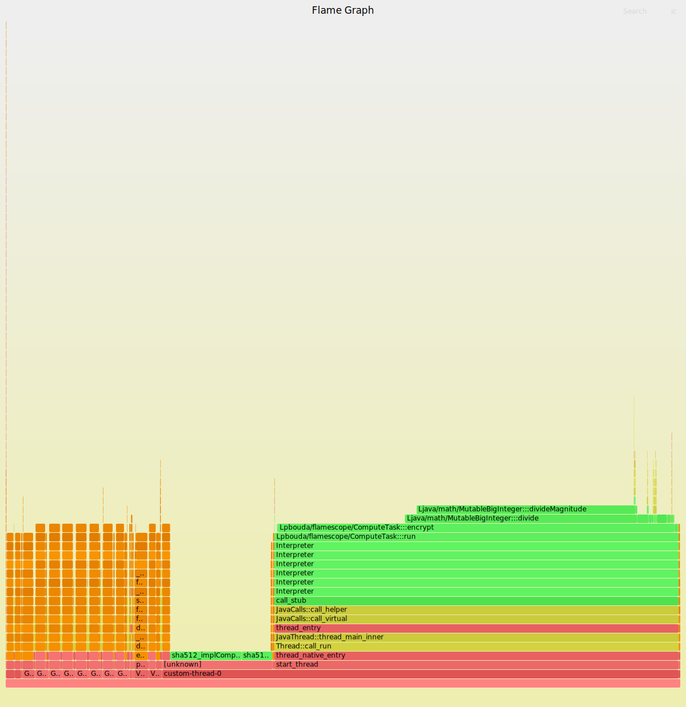

# FLAMEGRAPHS

```
-XX:+PreserveFramePointer 

Selects between using the RBP register as a general purpose register (-XX:-PreserveFramePointer) 
and using the RBP register to hold the frame pointer of the currently executing method 
(-XX:+PreserveFramePointer). If the frame pointer is available, then external 
profiling tools (for example, Linux perf) can construct more accurate stack traces.
```

### Create FlameGraph

```
# Run application
java -cp ./target/flamescope-1.0-SNAPSHOT.jar pbouda.flamescope.Scheduler
java -XX:+PreserveFramePointer -cp ./target/flamescope-1.0-SNAPSHOT.jar pbouda.flamescope.Scheduler

# Run Perf_events
perf record -F 99 -p `pgrep -f Scheduler` -g -- sleep 60

# Get Symbols from JAVA 
create-java-perf-map.sh `pgrep -f Scheduler`

# Make binary dump human readible
perf script > out.perf

# Folding stacktraces
stackcollapse-perf.pl --all out.perf > out.folded

# Create flamegraph
flamegraph.pl --color=java --hash out.folded > flamegraph.svg
```

#### Without FramePointers



#### With FramePointers



#### With FramePointers and Java Layout


